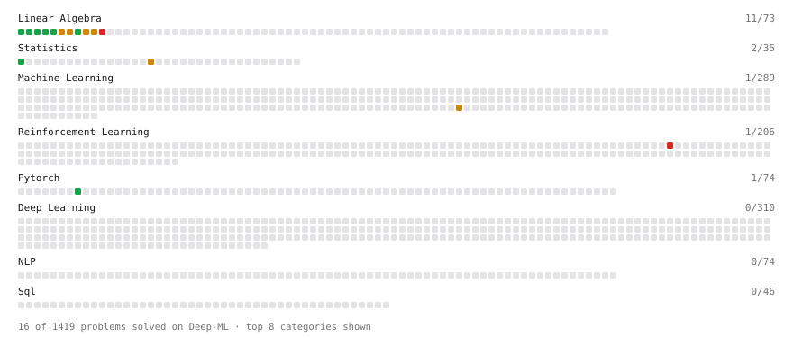

# Deep-ML

My machine learning practice from [Deep-ML](https://www.deep-ml.com). Every solution here was written by hand.

**22** solved · 21 problems · 1 labs · 0 math

[**Browse the interactive portfolio**](https://VMHETAR.github.io/deep-ml/) to replay this filling in over time.

## Problems

| | Difficulty | Solved | |
| --- | --- | --- | --- |
| [Build an MLP with nn.Sequential](https://www.deep-ml.com/problems/887) | easy | 2026-09-15 | [solution](problems/0887-build-an-mlp-with-nn-sequential) |
| [Calculate 2x2 Matrix Inverse](https://www.deep-ml.com/problems/8) | easy | 2026-09-15 | [solution](problems/0008-calculate-2x2-matrix-inverse) |
| [Calculate Covariance Matrix](https://www.deep-ml.com/problems/10) | easy | 2026-09-16 | [solution](problems/0010-calculate-covariance-matrix) |
| [Calculate Mean by Row or Column](https://www.deep-ml.com/problems/4) | easy | 2026-09-11 | [solution](problems/0004-calculate-mean-by-row-or-column) |
| [Feature Scaling Implementation](https://www.deep-ml.com/problems/16) | easy | 2026-09-19 | [solution](problems/0016-feature-scaling-implementation) |
| [Linear Regression Using Gradient Descent](https://www.deep-ml.com/problems/15) | easy | 2026-09-19 | [solution](problems/0015-linear-regression-using-gradient-descent) |
| [Linear Regression Using Normal Equation](https://www.deep-ml.com/problems/14) | easy | 2026-09-19 | [solution](problems/0014-linear-regression-using-normal-equation) |
| [Matrix-Vector Dot Product](https://www.deep-ml.com/problems/1) | easy | 2026-09-11 | [solution](problems/0001-matrix-vector-dot-product) |
| [Reshape Matrix](https://www.deep-ml.com/problems/3) | easy | 2026-09-11 | [solution](problems/0003-reshape-matrix) |
| [Scalar Multiplication of a Matrix](https://www.deep-ml.com/problems/5) | easy | 2026-09-14 | [solution](problems/0005-scalar-multiplication-of-a-matrix) |
| [Transpose of a Matrix](https://www.deep-ml.com/problems/2) | easy | 2026-09-11 | [solution](problems/0002-transpose-of-a-matrix) |
| [BIRCH Clustering for Large Datasets](https://www.deep-ml.com/problems/825) | medium | 2026-09-20 | [solution](problems/0825-birch-clustering-for-large-datasets) |
| [Calculate Eigenvalues of a Matrix](https://www.deep-ml.com/problems/6) | medium | 2026-09-15 | [solution](problems/0006-calculate-eigenvalues-of-a-matrix) |
| [K-Means Clustering](https://www.deep-ml.com/problems/17) | medium | 2026-09-19 | [solution](problems/0017-k-means-clustering) |
| [Matrix times Matrix ](https://www.deep-ml.com/problems/9) | medium | 2026-09-15 | [solution](problems/0009-matrix-times-matrix) |
| [Matrix Transformation ](https://www.deep-ml.com/problems/7) | medium | 2026-09-15 | [solution](problems/0007-matrix-transformation) |
| [Omitted-Variable Bias](https://www.deep-ml.com/problems/1358) | medium | 2026-09-17 | [solution](problems/1358-omitted-variable-bias) |
| [Solve Linear Equations using Jacobi Method](https://www.deep-ml.com/problems/11) | medium | 2026-09-16 | [solution](problems/0011-solve-linear-equations-using-jacobi-method) |
| [Toy Models of Superposition: Feature Reconstruction](https://www.deep-ml.com/problems/862) | medium | 2026-09-18 | [solution](problems/0862-toy-models-of-superposition-feature-reconstruction) |
| [Differential Sarsa Algorithm](https://www.deep-ml.com/problems/541) | hard | 2026-09-19 | [solution](problems/0541-differential-sarsa-algorithm) |
| [Singular Value Decomposition (SVD) of 2x2 Matrix](https://www.deep-ml.com/problems/12) | hard | 2026-09-18 | [solution](problems/0012-singular-value-decomposition-svd-of-2x2-matrix) |

## Labs

| | Difficulty | Solved | |
| --- | --- | --- | --- |
| [Train a Binary Classifier](https://www.deep-ml.com/labs/23) | easy | 2026-09-19 | [solution](labs/0023-train-a-binary-classifier) |

---

_This file is regenerated by Deep-ML on every push._
